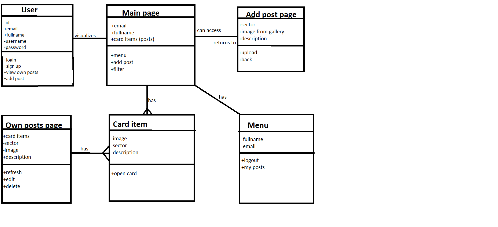

# Pet Finder app

## Epic story

Aplicatia va fi numita Pet Finder , in care fiecare utilizator va putea posta si vedea anunturi cu animale pierdute .

## Must Have

-   User registration and login

-   Ability to browse lost pets posts

-   Ability to add a lost pet post

## Should Have

-   Option to filter posts by sector.

-   Option to logout

-   Ability to zoom in on a post

-   A user menu , where email and fullname is displayed

-   Ability to check own posts , delete , edit , and refresh them

## Nice to Have

-   Account verification

-   Dark mode

-   Post should auto-delete after a number of days of inactivity

## Tehnologii folosite 

Android Studio, Java si PHP

## Link catre Backlog

    https://trello.com/b/rxMhMFrz/proiect-mds

## Diagrama UML

